# Provenance Guard — Project Planning & Specification

**Provenance Guard**, a backend system designed to analyze creative text submissions, evaluate the likelihood of AI generation, handle creator appeals, and provide structured transparency infrastructure.

---

## 🗺️ System Architecture

```mermaid
graph TD
    %% Submission Flow
    subgraph Submission Flow [POST /submit]
        A[Client Text Submission] -->|Raw Text & Creator ID| B[Flask Rate Limiter]
        B -->|Pass| C[Multi-xSignal Detection Pipeline]
        
        subgraph Pipeline [Detection Pipeline]
            C --> D[Signal 1: LLM Holistic Analysis]
            C --> E[Signal 2: Stylometric Heuristics]
            C --> F[Signal 3: Word Frequency Entropy]
        end
        
        D -->|LLM Score 0-1| G[Ensemble Weighted Scoring Engine]
        E -->|Heuristic Score 0-1| G
        F -->|Entropy Score 0-1| G
        
        G -->|Calibrated Confidence Score| H[Label Generation Logic]
        H -->|High AI / High Human / Uncertain| I[Structured Audit Log Writer]
        I -->|Commit JSON/SQLite| J[JSON Response API JSON]
    end

    %% Appeal Flow
    subgraph Appeal Flow [POST /appeal]
        K[Creator Appeal] -->|Content ID & Reasoning| L[Audit Log Lookup]
        L -->|Found| M[Update Status to 'under_review']
        M -->|Append Reasoning| N[Commit to Audit Log]
        N -->|Success| O[JSON Response Confirmation]
    end

```




### Flow Narratives

* **Submission Flow:** A user submits text via `POST /submit`. The request passes through a rate-limiting layer. If allowed, the text runs concurrently through three independent detection signals. The outputs are aggregated into a single calibrated confidence score. This score maps directly to a user-facing transparency label, writes a permanent record to the structured audit log, and returns a JSON payload to the platform client.
* **Appeal Flow:** Creators who wish to contest a classification hit `POST /appeal` with the target `content_id`. The system validates the ID against the audit log, updates the record status field to `under_review`, appends the creator's typed justification, and returns an immediate confirmation.

---

## 🧠 Functional Specification

### 1. Detection Signals & Calibration

To achieve **Ensemble Detection (Stretch Feature 1)**, the system combines three distinct structural and semantic properties of text:

| Signal Name | What It Measures | Why It Differs | Blind Spots / Pitfalls | Output Format |
| --- | --- | --- | --- | --- |
| **LLM Assessment** (`llama-3.3-70b`) | Holistic semantic structure, predictability, and phrase transitions. | AI text has highly uniform, optimized patterns and transitions. | Highly stylized or overly formal human academic writing. | Float (`0.0` to `1.0`) where 1.0 is highly likely AI. |
| **Stylometric Heuristics** | Sentence length variance and Type-Token Ratio (TTR) for vocabulary diversity. | Humans naturally vary sentence structures drastically; AI stays uniform. | Short text inputs (< 150 words) where statistical variance is compressed. | Float (`0.0` to `1.0`) where 1.0 is completely uniform. |
| **Word Frequency Entropy** | The distribution and predictability of common vocabulary tokens. | AI text skews heavily toward top-tier predictable dictionary terms. | Human technical documentation or legal briefs that require rigid terminology. | Float (`0.0` to `1.0`) where 1.0 matches generic AI distribution. |

#### Ensemble Weighting Formula

The final confidence score is computed as a weighted average to minimize false positives:


$$\text{Confidence} = (0.50 \times \text{LLM Score}) + (0.25 \times \text{Stylometric Score}) + (0.25 \times \text{Entropy Score})$$

### 2. Uncertainty Representation & Calibrated Thresholds

The system intentional treats raw results near the center as **Uncertain** to protect human creators from aggressive false positives.

* `0.00 <= Score < 0.35` $\rightarrow$ **Likely Human-Written**
* `0.35 <= Score <= 0.65` $\rightarrow$ **Uncertain / Borderline**
* `0.65 < Score <= 1.00` $\rightarrow$ **Likely AI-Generated**

### 3. Verbatim Transparency Label Design

These specific text combinations are returned directly in the API and rendered verbatim in frontend surfaces:

> **High-Confidence Human Label (`0.00 - 0.34`):**
> "Verified Human Work: Our system has high confidence that this content was entirely composed by a human creator."

> **Uncertain Label (`0.35 - 0.65`):**
> "Uncertain Attribution: This content displays a mix of stylistic signals. Our system cannot definitively classify its origin. Originality remains unverified."

> **High-Confidence AI Label (`0.66 - 1.00`):**
> "AI-Generated Content: Our system detected strong structural and linguistic patterns characteristic of automated language models."

### 4. Appeals Workflow & Human Review

* **Who can appeal:** Any platform user who receives a classification response matching an automated `content_id` associated with their account.
* **Payload Required:** `content_id` (UUIDv4) and `creator_reasoning` (String, minimum 15 characters).
* **System Action:** Updates the entry's `status` column from `classified` to `under_review` and appends the raw text string to `appeal_reasoning`.
* **Human Reviewer Queue View:** A human administrator accessing the dashboard sees a structured tabular layout highlighting fields: `Timestamp`, `Content ID`, `Combined Confidence Score`, `Assigned Label`, and the actionable `Creator Justification Text` ordered by oldest pending first.

---

## 🚀 Selected Stretch Features

1. **Ensemble Detection:** Described above. Utilizes a three-signal combined mathematical pipeline (LLM + Stylometrics + Word Entropy) instead of a simple dual-core evaluation pipeline.
2. **Provenance Certificate:** Creators who establish trusted histories (e.g., zero sustained AI flags over 5 consecutive long-form posts) earn a temporary cryptographically tracked `"verified_human"` credential. This injects a special secure badge metadata field into subsequent content responses: `"provenance_certificate": {"eligible": true, "badge_status": "active"}`.
3. **Analytics Dashboard (`GET /analytics`):** A lightweight statistics execution endpoint that aggregates the data log directly in real-time to compute and return:
* Total system submission volume.
* System-wide False Positive/Appeal rate percentage ($\frac{\text{Total Appeals}}{\text{Total Submissions}} \times 100$).
* Running baseline average confidence scores across all tracked submissions.


---

## 🎯 Anticipated Edge Cases & Pitfalls

* **Non-Native English Creative Writing:** Authors writing in English as a second language often select structured, highly formal vocabulary choices and uniform sentence lengths. This behavior directly mimics AI stylometrics, presenting a serious false-positive risk.
* **Hyper-Specific Multi-Line Poetry:** Structural poetry leveraging heavy intentional repetition (e.g., villanelles or pantoums) breaks baseline linguistic entropy heuristics, which could cause a false "Likely AI" classification.

---

## 🛠️ AI Tool Implementation Plan

### Milestone 3: Submission Endpoint & Core Stack

* **Sections provided to AI:** `Submission Flow Diagram`, `Detection Signals (LLM properties only)`.
* **Prompt Request:** "Generate a lightweight boilerplate Flask app featuring a POST `/submit` route accepting JSON data containing fields `text` and `creator_id`. Integrate a basic call to the Groq `llama-3.3-70b-versatile` API executing a structured system prompt that strictly returns a raw float representation from 0.0 to 1.0. Wire a basic SQLite logging write mechanism capturing the return database record."
* **Verification Strategy:** Execute local `curl` submission requests containing baseline sample mock text blocks and inspect the database engine outputs.

### Milestone 4: Multi-Signal Ensemble Pipeline

* **Sections provided to AI:** `Ensemble Weighting Formula`, `Detection Signals Table`.
* **Prompt Request:** "Create pure Python functions calculating sentence length variance and basic Type-Token Ratio from string inputs. Integrate these values with the existing Groq LLM score function into a single unified weighting engine calculation matching the mathematical spec formula weights."
* **Verification Strategy:** Feed the test cases specified in the project guidelines (formal prose vs completely informal raw stream-of-consciousness chat texts) and confirm that confidence scores change predictably.

### Milestone 5: Production Layer & Stretch Systems

* **Sections provided to AI:** `Uncertainty Representation & Calibrated Thresholds`, `Verbatim Transparency Label Design`, `Appeals Workflow`.
* **Prompt Request:** "Implement the threshold-mapping conditional statement routing the aggregate score directly to the three explicit string-for-string label variants. Next, create a POST `/appeal` endpoint updating an active record status parameter inside our file log to `under_review` and appending the text variable `creator_reasoning`. Finally, add a fast math evaluation utility route `/analytics` summing total logs and calculating current global appeal ratios."
* **Verification Strategy:** Submit an appeal payload linking a valid `content_id`. Assert that calling `GET /log` and `GET /analytics` reflects the updated state properties exactly.

```